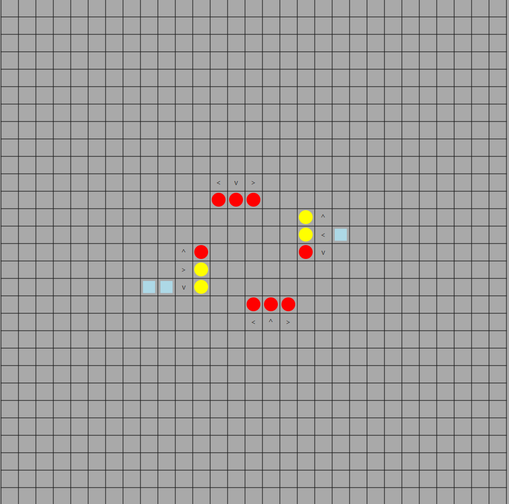

# Traffic simulation

This project is a simulation of an intersection, where the algorithm chooses which lights should turn green next. The cars arrive from 4 directions, and for each direction there are 3 lanes leading left, forward, or right.

## Algorithm

The idea is simple. During each step of the simulation, the following happens:

1. Select lane combination that has the biggest total waiting time and isn't empty.
2. If no neglected lane combination was selected, select lane combination that has the biggest total amount of vehicles.
3. Keep moving open lanes until minimum waiting time passes.
4. Start again, close active the lanes if the next combination is different from current.

Safe lane combinations are explicitly specified.
Through these steps we are always freeing the most busy lane combination while at the same time keeping all lanes from being closed for too long. Minimal open time provides that we don't waste too much time on yellow lights.

## Input

Input files are accepted in the following format:

```json
"commands": [

    {

      "type": "addVehicle",

      "vehicleId": "vehicle1",

      "startRoad": "south",

      "endRoad": "north"

    },

    {

      "type": "addVehicle",

      "vehicleId": "vehicle2",

      "startRoad": "north",

      "endRoad": "south"

    },

    {

      "type": "step"

    }]
```

## Output

When provided an output file, simulation statuses are saved in the following format:

```json
"stepStatuses": [

    {

      "leftVehicles": [

        "vehicle1",

        "vehicle2"

      ]

    },

    {

      "leftVehicles": []

    },

]
```

## GUI

Simple JavaFX app for visualisation.

